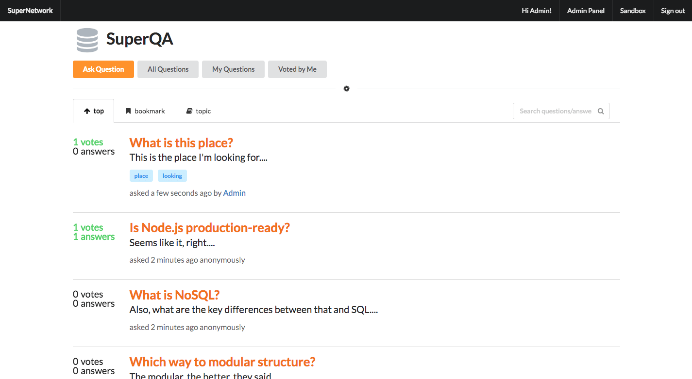
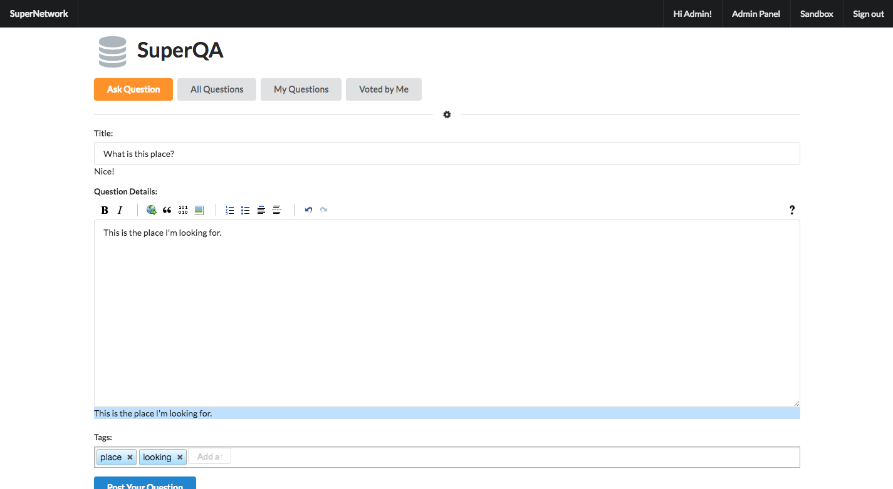

# Super QA Demo

This project was generated with the [Angular Full-Stack Generator](https://github.com/DaftMonk/generator-angular-fullstack) version 3.3.0. A lot easier than version 4+.





--------------------------------------------------------------------------------

## Getting Started

**SPECIAL:**

- Run `npm run setup` to do all of the npm-related things.
- Run `npm run setup:quick` to install all dependencies.

### Prerequisites

- [Git](https://git-scm.com)
  - `brew install git`
- [Node.js and npm](nodejs.org)
  - `brew install node`
- [Express](http://expressjs.com)
- [Angular](https://angularjs.org)
- [MongoDB](https://mongodb.org)
  - `brew install mongodb`
- [Yarn](https://yarnpkg.com)
  - `npm install --global yarn`
- [Bower](http://bower.io)
  - `npm install --global bower`
- [Gulp](http://gulpjs.com)
  - `npm install --global gulp`

### Tools

Node.js, npm, Yarn, Bower, Gulp, Grunt, Babel, Karma, Mocha, JSHint, Node Inspector, LiveReload, Protractor, Jade, Stylus, Sass, Less, and EditorConfig.

### Development

1. Run `yarn install` or `npm install` to install server dependencies.
2. Run `bower install` to install front-end dependencies.
   - If there's something wrong when serving the app, run `bower install --save angular` separately, then choose the last option. This is due the current `angular-pagedown` that I'm using is about obsolete. Will upgrade it soon.
3. Run `mongod` in a separate shell to keep an instance of the MongoDB Daemon running. [Homebrew and Lunchy make this easy](https://changelog.com/posts/lunchy-a-friendly-wrapper-for-launchctl).
4. [Fix some problems with Semantic](#problems). Just a quick rename.
5. Run `gulp serve` to start the development server. It should automatically open the client in your browser when ready.

**Extra**

Edit `server/config/local.env.js` to suit your OAuth needs.

### Build and Development

Run `gulp build` for building and `gulp serve` for preview.

### Testing

Run `npm test` will run the unit tests with Karma.

--------------------------------------------------------------------------------

## API

**Server Endpoint Prefix:** `/api`

### Misc

| Method | URL | Description
|--------|-----|-------------
| GET    | `/` | Get home page

### Users

| Method | URL | Description
|--------|-----|-------------
| GET    | `/users` | Get list of users (if admin)
| POST   | `/users` | Create a user
| POST   | `/auth/local`          | Auth with local strategy
| GET    | `/users/me`            | Go to user home page
| DELETE | `/users/:id`           | Delete a user (if admin)
| GET    | `/users/:id/password`  | Get my settings for password
| GET    | `/users/:userId`       | Get my questions
| GET    | `/users/:userId/votes` | Get my voted questions

### Questions

| Method | URL | Description
|--------|-----|-------------
| GET    | `/questions`     | Get all questions
| GET    | `/questions/:id` | Get a question
| POST   | `/questions`     | Post a question
| PUT    | `/questions/:id` | Update a question title/content
| PATCH  | `/questions/:id` | Patch a question title/content
| DELETE | `/questions/:id` | Delete a question

### Answers

| Method | URL | Description
|--------|-----|-------------
| POST   | `/questions/:id/answers`           | Create answer for a question
| PUT    | `/questions/:id/answers/:answerId` | Update an answer in the question
| DELETE | `/questions/:id/answers/:answerId` | Delete an answer in the question

### Votes

| Method | URL | Description
|--------|-----|-------------
| POST   | `/questions/:id/vote` | Upvote a question
| DELETE | `/questions/:id/vote` | Unvote a question
| POST   | `/questions/:id/answers/:answerId/vote` | Upvote an answer
| DELETE | `/questions/:id/answers/:answerId/unvote` | Unvote an answer

--------------------------------------------------------------------------------

## Problems

There is an automatic `wiredep:client` in gulp process. In `client/bower_components/semantic/bower.json` change the provided `main` property likewise:

```js
"main": [
  "dist/semantic.min.css",
  "dist/semantic.min.js"
],
```
